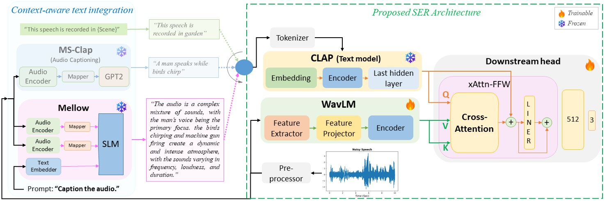

[](https://zenodo.org/records/19451882)
[](https://snehitc.github.io/Reasoning-driven-SER/)
[!Paper](https://img.shields.io/badge/Paper-ICASSP--2026-navy?logo=ieee)](https://ieeexplore.ieee.org/document/11460654)

# Reasoning-driven-SER
Official Implementation of research paper "Reasoning Driven Captions To Assist Noise Robust Speech Emotion Recognition" accepted for publication in ICASSP 2026

# Pipeline


| Check out Example: 🔈 [](https://snehitc.github.io/Reasoning-driven-SER/) |
|-|


# Setup
### 1. Clone the repository
```
git clone https://github.com/Snehitc/Reasoning-driven-SER.git
cd Reasoning-driven-SER
```

### 2. Create environment
```
conda create -n Rd_SER python=3.9
```
```
conda activate Rd_SER
```

### 3. Install Torch (CUDA version)
```
pip install torch==2.1.2 torchaudio==2.1.2 --index-url https://download.pytorch.org/whl/cu118
```

### 4. Install requirements
```
pip install -r requirements.txt
```


### 5. Add mellow
>Mellow
>```
>git clone https://github.com/soham97/mellow.git
>```
>>$$\textbf{{\color{red}Important:}}$$ \
>>Replace $${\color{red}wrapper.py}$$ file from official mellow implimentation with our $${\color{blue}wrapper.py}$$. Please find our file in the __mellow_replace_wrapper__ directory.\
>>```.\mellow\mellow\wrapper.py``` replace this file with ```.\mellow_replace_wrapper\wrapper.py```\
>>\
>>__Reason__: I have modified the wrapper file to take an audio tensor as input instead of an audio filename; since we are creating noisy samples in real time by mixing speech (MSP) with noise (Freesound) in tensor form.


### 6. Add our checkpoints
Please download our best-trained model's checkpoint from [Zenodo](https://zenodo.org/records/19451882) (filename: __RdSER_Mellow_BestModel.pt__), place this file in ```.\model\ckpt``` directory. Check [Directory Structure](https://github.com/Snehitc/Reasoning-driven-SER#directory-structure) for better understanding.

> Note:
> - This trained model only contains the checkpoints for __WavLM__ and __Downstream Head__, and not __CLAP__, since the __CLAP__ object was kept frozen while finetuning.
> - However, while the model's instantiation __CLAP__ will automatically load pretrained weights from HuggingFace 🤗 using from_pretrained command.


### 7. Add Dataset
Arrange this data in the directories specified in [Directory Structure](https://github.com/Snehitc/Reasoning-driven-SER#directory-structure).
- Speech: [MSP podcast](https://www.lab-msp.com/MSP/MSP-Podcast.html) (Release 1.10)
- Noise: [FreeSound](https://freesound.org/) and other noise datasets (Manually scraped data for classes mentioned in our paper)


### 8. Evaluate
Run this script to get the results for our best-trained model
```
python evaluate.py
```


# Results
<table style="text-align: center;">
  <thead>
    <tr>
      <th rowspan="2">SNR</th>
      <th rowspan="2">Score</th>
      <th rowspan="2">Audio-only</th>
      <th colspan="2">Text-only</th>
      <th colspan="3">Baseline <br>Audio+Text: Feature Concatenation</th>
      <th colspan="3">$${\color{blue}Proposed}$$ <br>Audio+Text: Cross-Attention</th>
    </tr>
    <tr>
        <td>Transcript</td>
        <td>Mellow</td>
        <td>Scene</td>
        <td>MS-CLAP</td>
        <td>Mellow</td>
        <td>Scene</td>
        <td>MS-CLAP</td>
        <td>$${\color{blue}Mellow}$$</td>
    </tr>
  </thead>
  <tbody align="center">
    <tr style="height: 50px;">
      <td rowspan="3">5dB</td>
      <td>Arousal</td>
      <td>0.5929</td>
      <td>0.0912</td>
      <td>0.0557</td>
      <td>0.5911</td>
      <td>0.5856</td>
      <td>0.5899</td>
      <td>0.5908</td>
      <td>$${\color{blue}0.6046}$$</td>
      <td>0.6004</td>
    </tr>
    <tr>
      <td>Valence</td>
      <td>0.4385</td>
      <td>0.1410</td>
      <td>0.0132</td>
      <td>$${\color{blue}0.4497}$$</td>
      <td>0.3888</td>
      <td>0.3939</td>
      <td>0.4071</td>
      <td>0.4272</td>
      <td>0.4475</td>
    </tr>
    <tr>
      <td>Dominance</td>
      <td>0.4909</td>
      <td>0.0041</td>
      <td>0.0073</td>
      <td>0.4779</td>
      <td>0.4564</td>
      <td>0.4761</td>
      <td>0.4791</td>
      <td>$${\color{blue}0.4922}$$</td>
      <td>0.4837</td>
    </tr>
      <td rowspan="3">0dB</td>
      <td>Arousal</td>
      <td>0.5736</td>
      <td>0.0912</td>
      <td>0.0552</td>
      <td>0.5713</td>
      <td>0.5673</td>
      <td>0.5705</td>
      <td>0.5594</td>
      <td>$${\color{blue}0.5852}$$</td>
      <td>0.5847</td>
    </tr>
    <tr>
      <td>Valence</td>
      <td>0.4122</td>
      <td>0.1410</td>
      <td>0.0119</td>
      <td>0.4215</td>
      <td>0.3684</td>
      <td>0.3695</td>
      <td>0.3957</td>
      <td>0.4055</td>
      <td>$${\color{blue}0.4227}$$</td>
    </tr>
    <tr>
      <td>Dominance</td>
      <td>0.4763</td>
      <td>0.0041</td>
      <td>0.0068</td>
      <td>0.4604</td>
      <td>0.4409</td>
      <td>0.4611</td>
      <td>0.4635</td>
      <td>$${\color{blue}0.4822}$$</td>
      <td>0.4768</td>
    </tr>
    </tr>
      <td rowspan="3">-5dB</td>
      <td>Arousal</td>
      <td>0.4808</td>
      <td>0.0912</td>
      <td>0.0492</td>
      <td>0.5043</td>
      <td>0.4844</td>
      <td>0.4859</td>
      <td>0.4743</td>
      <td>0.5201</td>
      <td>$${\color{blue}0.5304}$$</td>
    </tr>
    <tr>
      <td>Valence</td>
      <td>0.3460</td>
      <td>0.1410</td>
      <td>0.0036</td>
      <td>0.3359</td>
      <td>0.3110</td>
      <td>0.3044</td>
      <td>0.3408</td>
      <td>0.3493</td>
      <td>$${\color{blue}0.3659}$$</td>
    </tr>
    <tr>
      <td>Dominance</td>
      <td>0.3899</td>
      <td>0.0041</td>
      <td>0.0048</td>
      <td>0.4017</td>
      <td>0.3619</td>
      <td>0.3840</td>
      <td>0.4007</td>
      <td>0.4232</td>
      <td>$${\color{blue}0.4248}$$</td>
    </tr>
    </tr>
      <td rowspan="3">-10dB</td>
      <td>Arousal</td>
      <td>0.2484</td>
      <td>0.0912</td>
      <td>0.0415</td>
      <td>0.3251</td>
      <td>0.2984</td>
      <td>0.2982</td>
      <td>0.3195</td>
      <td>0.3174</td>
      <td>$${\color{blue}0.3523}$$</td>
    </tr>
    <tr>
      <td>Valence</td>
      <td>0.2155</td>
      <td>0.1410</td>
      <td>0.0035</td>
      <td>0.1857</td>
      <td>0.2086</td>
      <td>0.2014</td>
      <td>0.2371</td>
      <td>0.2353</td>
      <td>$${\color{blue}0.2553}$$</td>
    </tr>
    <tr>
      <td>Dominance</td>
      <td>0.1862</td>
      <td>0.0041</td>
      <td>0.0026</td>
      <td>0.2518</td>
      <td>0.2069</td>
      <td>0.2242</td>
      <td>$${\color{blue}0.2568}$$</td>
      <td>0.2323</td>
      <td>0.2505</td>
    </tr>
  </tbody>
</table>
Table: CCC scores on Unseen Synthetic Noisy Speech (Speech: MSP-Podcast-Test1 set) at diverse SNRs comparing Proposed and Baseline with respect to all Context-Aware Texts performance. (Text-only: Transcripts are ground-truth version)


# Directory Structure
```
Reasoning-driven-SER
      |___evaluate.py
      |___config.yaml
      |___requirements.txt
      
      |___model
          |___model.py
          |___ckpt
              |___# Add "RdSER_Mellow_BestModel.pt" in this dir
      
      |___utils
          |___utils.py
      
      |___dataset
          |___MSP_dataset.py
          |___MSP
              |___Audio
              |___labels
          |___FreeSound_Noise
              |___Test
                  |___tram
                  |___sea
                  |___ ...
  
      |___mellow_replace_wrapper
          |___wrapper.py # Our file modified version of Mellow's official version
  
      |___mellow
          |___mellow
              |___wrapper.py # Important: Replace this file with Our "wrapper.py"
          |___ ...
```

# Citation
> S. B. Chunarkar and C. -C. Lee, "Reasoning Driven Captions to Assist Noise Robust Speech Emotion Recognition," ICASSP 2026 - 2026 IEEE International Conference on Acoustics, Speech and Signal Processing (ICASSP), Barcelona, Spain, 2026, pp. 17197-17201, doi: 10.1109/ICASSP55912.2026.11460654.,
```
@INPROCEEDINGS{11460654,
  author={Chunarkar, Snehit B. and Lee, Chi-Chun},
  booktitle={ICASSP 2026 - 2026 IEEE International Conference on Acoustics, Speech and Signal Processing (ICASSP)}, 
  title={Reasoning Driven Captions to Assist Noise Robust Speech Emotion Recognition}, 
  year={2026},
  volume={},
  number={},
  pages={17197-17201},
  doi={10.1109/ICASSP55912.2026.11460654}}
```


# TODO
- [x] Readme
  - [x] Pipeline (fig)
  - [x] Results
  - [x] Example
  - [x] Directory Structure
  - [x] Citation (coming soon: ICASSP 2026)
- [x] Code files
  - [x] Config
  - [x] Dataloader
  - [x] Utils: Mellow
  - [x] Model object
  - [x] Customised mellow wrapper
  - [x] Evaluation
  - [x] Requirements
- [x] Trained model's checkpoint 
